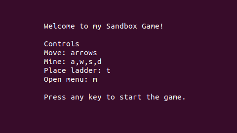
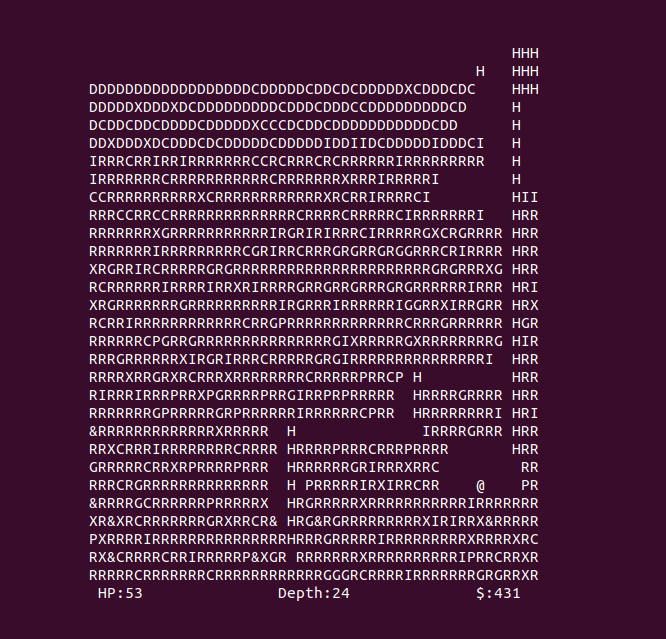
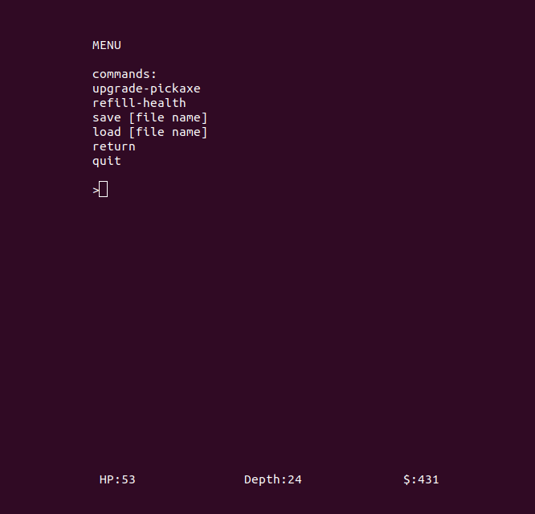

# cpp-sandbox-game
Semestral project for C++ programming course.

## About
This is a simple terminal game created using the ```ncurses``` library. It is a sandbox mining game, where the player can move around the playing field and mine different materials in order to earn money for upgrades. There are also simple enemies that the player can attack and traps that are disguised as other materials but they explode when destroyed. The player takes fall damage if he falls to far and needs to use ladders to get back up.

It is also possible to save/load the game to/from a file (example scenes in ```examples``` directory).

## Setup
In order for everything to run correctly, you need to download some libraries: ```libncurses5-dev libncursesw5-dev``` for the graphics and ```doxygen graphviz``` for documentation generation.

After everything is downloaded, run ```make``` to compile and create the executable ```sandbox_game```. Run that to start the game.

## Screenshots
**Controlls:**



**Game example:**
* ```@``` character is the player
* ```H``` characters are ladders that the player can climb on
* ```X``` characters are the enemies
* the rest are blocks that the player can mine and earn money from them


**Menu:**


